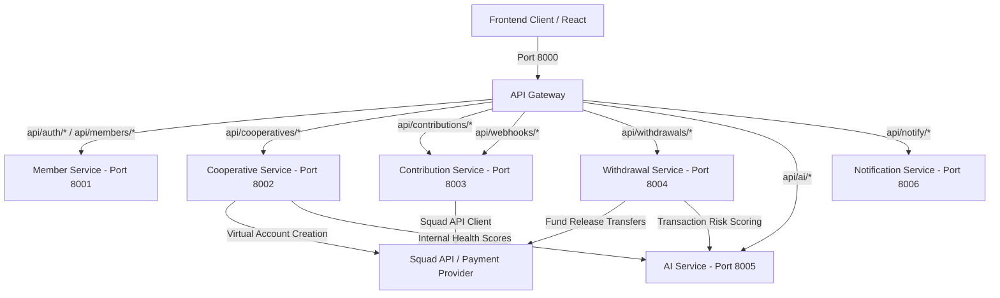
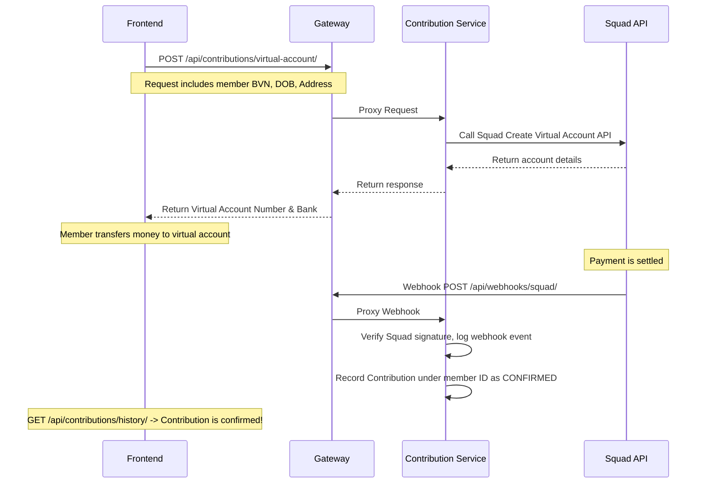

# VeriFund Backend Integration Overview

This document provides a comprehensive guide to the VeriFund microservices backend to help frontend developers integrate endpoints and understand the state management, payment models, and security workflows.

---

## 1. System Architecture & Routing

VeriFund is designed as a distributed Python/Django microservices architecture. It includes an **API Gateway** acting as the single entry point for all frontend traffic. The browser/frontend client should **only** communicate with the gateway, which forwards requests internally to downstream services.



### Microservices Directory Reference
- **API Gateway (Port 8000)**: Defined in [urls.py](file:///Users/mac/Documents/VeriFund/api-gateway/config/urls.py). Handles incoming routes and JWT validation.
- **Member Service (Port 8001)**: Implements member lookup and login in [auth_views.py](file:///Users/mac/Documents/VeriFund/member-service/member_service/views/auth_views.py) and profile details in [member_views.py](file:///Users/mac/Documents/VeriFund/member-service/member_service/views/member_views.py).
- **Cooperative Service (Port 8002)**: Implements cooperative details, trust scores, and regulator audits in [cooperative_views.py](file:///Users/mac/Documents/VeriFund/cooperative-service/cooperative_service/views/cooperative_views.py).
- **Contribution Service (Port 8003)**: Tracks payments, virtual accounts, and webhooks in [contribution_views.py](file:///Users/mac/Documents/VeriFund/contribution-service/contribution_service/views/contribution_views.py).
- **Withdrawal Service (Port 8004)**: Manages lookups, signing, and requerying in [withdrawal_views.py](file:///Users/mac/Documents/VeriFund/withdrawal-service/withdrawal_service/views/withdrawal_views.py).
- **AI Service (Port 8005)**: Handles transaction scoring, health breakdowns, whitelist triage, and graph anomalies in [ai_views.py](file:///Users/mac/Documents/VeriFund/ai-service/ai_service/views/ai_views.py).
- **Notification Service (Port 8006)**: Sends notifications and logs transmission history in [notification_views.py](file:///Users/mac/Documents/VeriFund/notification-service/notification_service/views/notification_views.py).

---

## 2. API Design & Security Standards

### Gateway Base URL
- **Local Development**: `http://localhost:8000`
- **Production URL**: `https://verifund-production-0ae5.up.railway.app`

### Authentication Mechanism
Authentication uses stateless **JWT Bearer Tokens**. 
- Public endpoints: Register (`/api/auth/register/`) and Login (`/api/auth/login/`).
- Protected endpoints: Require an `Authorization` header formatted as:
  ```http
  Authorization: Bearer <your_jwt_token>
  ```
- **Token Payload**: The JWT holds claims including the `member_id` and the member's security `role` (e.g., `MEMBER`, `TREASURER`, `EXECUTIVE1`, `EXECUTIVE2`, `ADMIN`). See [auth.py](file:///Users/mac/Documents/VeriFund/shared/middleware/auth.py) for the token processing logic.

### Error Handling Standard
When a request fails, the API returns standard HTTP status codes (`400`, `401`, `403`, `404`, `500`, `503`) alongside a consistent JSON payload:
```json
{
  "detail": "Descriptive error message explaining the failure."
}
```

---

## 3. Logical Endpoint Dictionary

| Area | Method | Endpoint | Auth | Request Schema / Fields | Response Schema / Keys |
| :--- | :--- | :--- | :--- | :--- | :--- |
| **Auth** | `POST` | `/api/auth/register/` | Public | `bvn`, `first_name`, `last_name`, `phone_number`, `email` (opt), `password` | `{ "member": { id, ... }, "token" }` |
| **Auth** | `POST` | `/api/auth/login/` | Public | `phone_number`, `password` | `{ "token", "member_id", "role" }` |
| **Member** | `GET` | `/api/members/me/` | Bearer | None | `{ id, first_name, last_name, phone_number, email, bvn_verified, role, is_active }` |
| **Member** | `PATCH` | `/api/members/me/` | Bearer | `first_name` (opt), `last_name` (opt), `phone_number` (opt), `email` (opt) | `{ "member": { id, ... } }` |
| **Coop** | `POST` | `/api/cooperatives/` | Bearer | `name`, `registration_number`, `state`, `cooperative_type` (THRIFT/CREDIT/MULTIPURPOSE), `treasurer_bvn` | `{ id, name, squad_virtual_account_number, ... }` |
| **Coop** | `GET` | `/api/cooperatives/{coop_id}/` | Bearer | None | Cooperative details including `health_score` |
| **Coop** | `GET` | `/api/cooperatives/{coop_id}/trust-score/` | Public* | None | `{ health_score, breakdown, badge, top_features }` |
| **Coop** | `GET` | `/api/cooperatives/{coop_id}/regulator-summary/` | Public* | None | Consolidated audit summary (coop, trust score, transaction volumes) |
| **Payment** | `POST` | `/api/contributions/virtual-account/` | Bearer | `cooperative_id`, `bvn`, `dob` (MM/DD/YYYY), `address`, `gender` (1=M, 2=F), `phone_number` (opt), `email` (opt) | `{ virtual_account: { virtual_account_number, bank_name, ... }, instructions }` |
| **Payment** | `GET` | `/api/contributions/virtual-account/list/` | Bearer | None | `{ member_id, virtual_accounts: [...] }` |
| **Payment** | `POST` | `/api/contributions/virtual-account/simulate/` | Bearer | `cooperative_id`, `amount_kobo` | `{ success, message, data: { transaction_reference }, recorded_contribution }` |
| **Payment** | `GET` | `/api/contributions/history/` | Bearer | None | `{ member_id, contributions: [...] }` |
| **Payment** | `GET` | `/api/contributions/audit/{coop_id}/` | Bearer | None | Contribution summary statistics + list of virtual accounts and mandates |
| **Payment** | `POST` | `/api/webhooks/squad/` | Public | Squad Webhook payload | Webhook event verification status |
| **Payment** | `GET` | `/api/contributions/webhooks/events/` | Bearer | Query `limit` (default 50) | `{ events: [ { id, event_name, signature_valid, ... } ] }` |
| **Multi-Sig**| `POST` | `/api/withdrawals/lookup/` | Bearer | `destination_bank_code`, `destination_account` | `{ bank_code, account_number, account_name }` |
| **Multi-Sig**| `POST` | `/api/withdrawals/request/` | Bearer | `cooperative_id`, `amount_kobo`, `destination_account`, `destination_bank_code`, `purpose` | `{ id, amount_kobo, ai_risk_score, status: 'PENDING_SIGNATURES', ... }` |
| **Multi-Sig**| `GET` | `/api/withdrawals/{withdrawal_id}/` | Bearer | None | Complete details + signatures list |
| **Multi-Sig**| `GET` | `/api/withdrawals/pending/?cooperative_id={coop_id}` | Bearer | None | `{ pending: [...], cooperative_id }` |
| **Multi-Sig**| `POST` | `/api/withdrawals/{withdrawal_id}/sign/` | Bearer | `role` (TREASURER / EXECUTIVE1 / EXECUTIVE2) | `{ withdrawal_id, status, signatures_collected, ... }` |
| **Multi-Sig**| `POST` | `/api/withdrawals/{withdrawal_id}/requery/` | Bearer | None | `{ withdrawal: {...}, provider_result: { success, ... } }` |
| **AI** | `POST` | `/api/ai/score-transaction/` | Public | `amount_kobo`, `rolling_90d_mean`, `days_since_last_contribution`, `member_transaction_count`, `cooperative_flagged_rate` | `{ anomaly_score, flagged, reason }` |
| **AI** | `POST` | `/api/ai/score-cooperative/` | Public | `cooperative_id`, `breakdown` / `features` object | `{ cooperative_id, risk_score, health_score, top_features }` |
| **AI** | `GET` | `/api/ai/score-cooperative/{coop_id}/` | Public | None | Stored cooperative AI score details |
| **AI** | `POST` | `/api/ai/triage-report/` | Public | `report_text`, `reporter_cooperative_id` | Whistleblower analysis: `{ intent, corroboration_score, escalate: bool }` |
| **AI** | `POST` | `/api/ai/analyze-graph/` | Public | `cooperative_id` | Full node-edge graph modeling + `suspicious_clusters` analysis |
| **AI** | `GET` | `/api/ai/analyze-graph/{coop_id}/` | Public | None | Stored graph analytics |
| **AI** | `GET` | `/api/ai/health-scores/` | Public | None | `{ scores: { "{cooperative_id}": health_score } }` |
| **Notify** | `POST` | `/api/notify/email/` | Public | `email` or `to`, `message`, `subject` | `{ status, recipient }` |
| **Notify** | `POST` | `/api/notify/sms/` | Public | `phone_number` or `to`, `message` | `{ status, recipient }` |
| **Notify** | `GET` | `/api/notify/history/` | Public | Query: `recipient` (opt), `status` (opt), `limit` | `{ notifications: [...] }` |
| **Ops** | `GET` | `/api/ops/qa-scoreboard/` | Public | None | QA test suite run summary metrics |

> [!NOTE]
> Endpoints indicated with `Public*` do not require client JWT headers because they are designed for external regulator dashboards or open compliance badges.

---

## 4. Key Integration Workflows

### 4.1. Member Registration & Profile Security
1. The user registers via `POST /api/auth/register/`.
2. The backend hashes the BVN (`SHA256`) to ensure BVN data is never stored in plaintext while preventing duplicate registration.
3. The response contains the JWT and a member profile. The `bvn_verified` field will initially be `false`.
4. The user completes onboarding by executing `POST /api/contributions/virtual-account/` which verifies their BVN with Squad and updates `bvn_verified` to `true`.

### 4.2. Contribution Processing Flow


### 4.3. Multi-Signature Withdrawal Flow
To ensure fund safety, all withdrawals must be authorized by multiple roles and pass AI risk screening:

1. **Initiation**: An authorized user calls `POST /api/withdrawals/request/`.
2. **AI Screening**: The backend immediately routes the request to the AI Service to score the withdrawal request. If the computed `ai_risk_score > 0.7`, the request status is set to `BLOCKED`. Otherwise, the status becomes `PARTIALLY_SIGNED`.
3. **Signatures**: Up to 3 signatures are collected.
   - Executives log in and call `POST /api/withdrawals/{withdrawal_id}/sign/` specifying their `role` (e.g. `EXECUTIVE1`, `EXECUTIVE2`, `TREASURER`).
   - The backend records each signature block in the `signatures` table.
4. **Execution**: Once the required number of signatures is satisfied:
   - The status updates to `TRANSFER_PENDING`.
   - The service sends an outbound fund transfer request to the Squad API.
   - On success, the status transitions to `RELEASED`. If it fails or is delayed, it transitions to `FAILED` or can be verified by hitting `POST /api/withdrawals/{withdrawal_id}/requery/`.

---

## 5. Direct-Debit Mandate Routing Status

The downstream **Contribution Service** has been updated to register the direct-debit mandate endpoints in [contribution_urls.py](file:///Users/mac/Documents/VeriFund/contribution-service/contribution_service/urls/contribution_urls.py). 

The following frontend integration methods are now fully supported by the backend:
1. `apiService.createMandate(request)` -> maps to `POST /api/contributions/mandate/` -> handled by `CreateMandateView`
2. `apiService.getMandate(reference)` -> maps to `GET /api/contributions/mandate/{reference}/` -> handled by `MandateStatusView`
3. `apiService.debitMandate(request)` -> maps to `POST /api/contributions/mandate/debit/` -> handled by `DebitMandateView`

> [!NOTE]
> All direct-debit mandate routes are fully registered and compile-verified.

